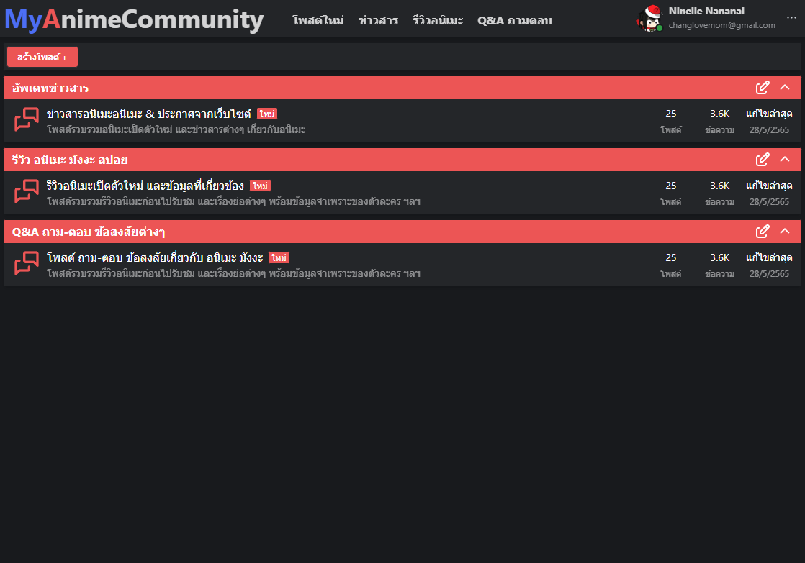
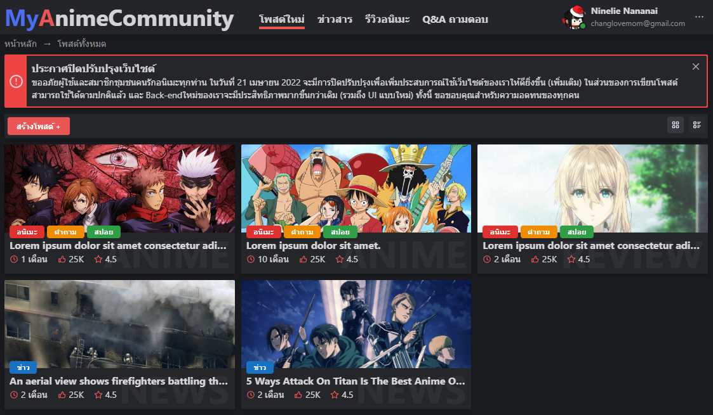
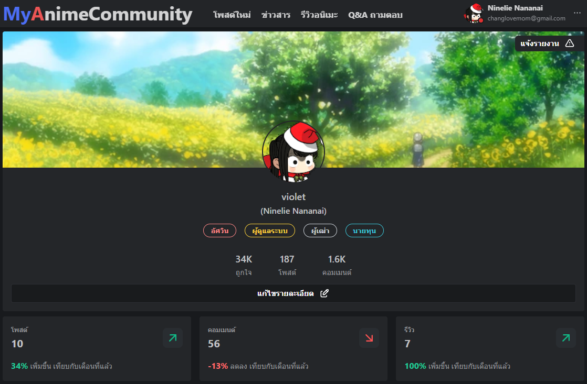
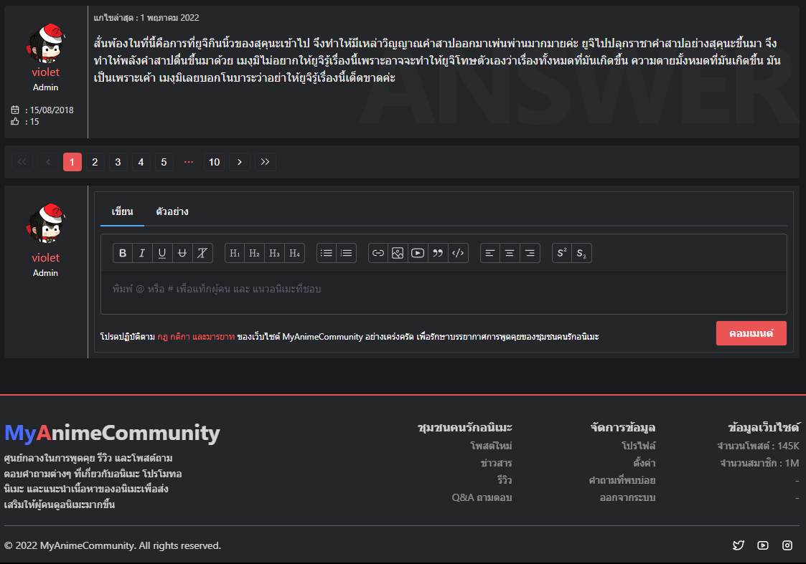
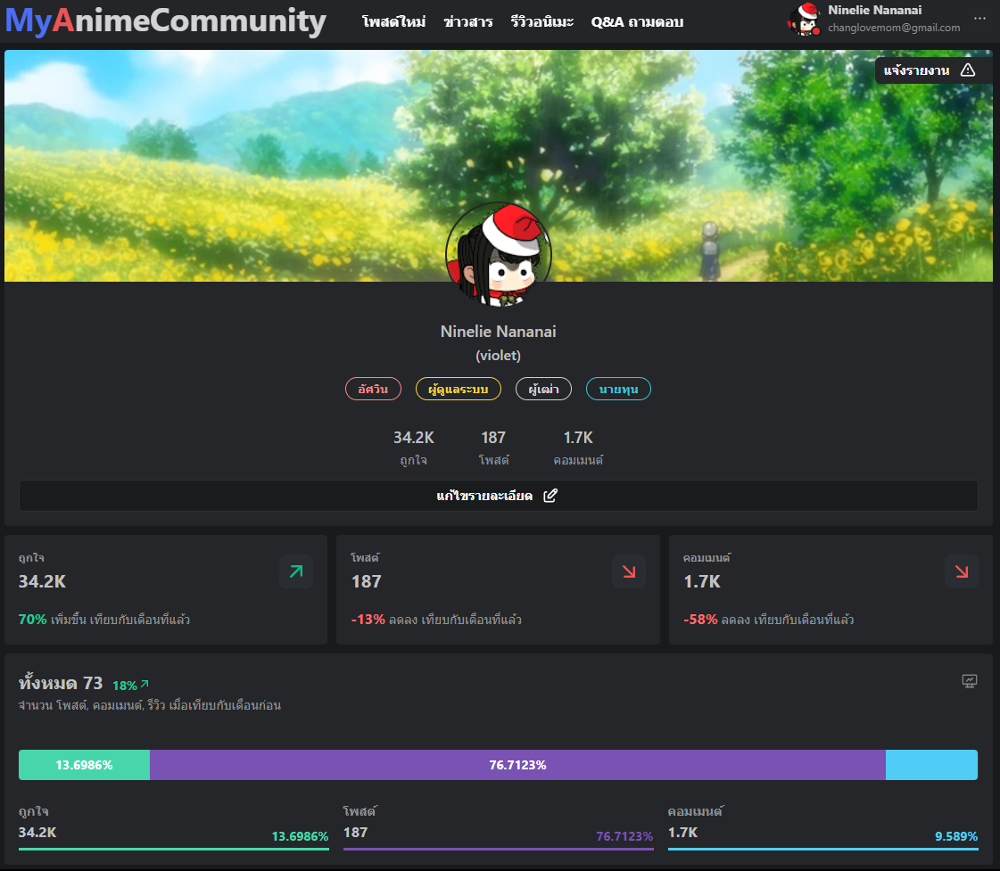
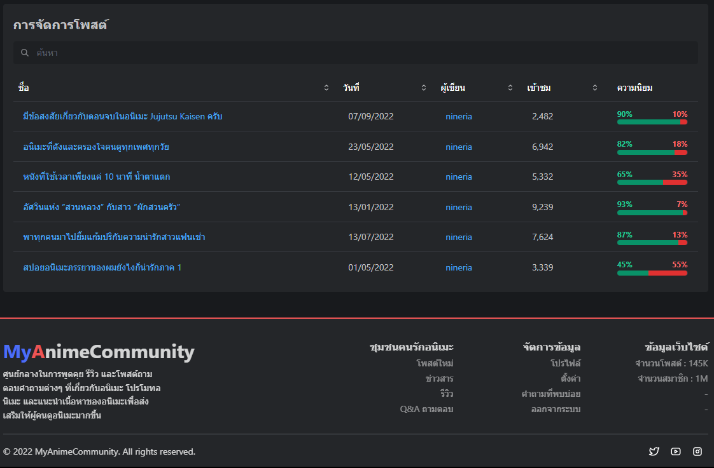
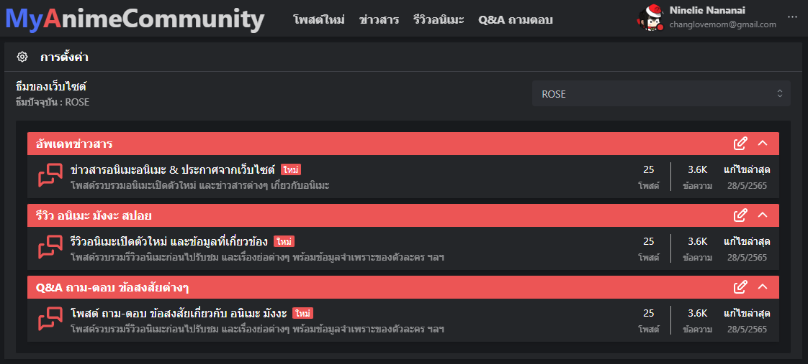

# My Anime Community

[https://myanimecommunity.vercel.app](https://myanimecommunity.vercel.app)

## Description

My Anime Community website purpose is to bring together people who like anime. They can come in and talk and exchange knowledge about anime, manga or light novels.

### Home page


### All Posts


### Post


### Comments


### Profile


### Statistics


### Setting (Theme)



## Stack

- [Next.js](https://nextjs.org/) - The React Framework for Production
- [Firebase](https://firebase.google.com/) - Cross-platform SDKs documentation help you build and ship apps on Android, iOS and Website
- [Mantine](https://mantine.dev/) - Mantine core library includes all essential components: inputs, buttons, modals, popovers, typography elements, layout management, etc.
- [React Simple Animate](https://react-simple-animate.vercel.app/) - UI Animation Made Simple
- [Tabler Icons](https://github.com/tabler/tabler-icons) - Pixel-perfect icons for web design

## Project structure

```
$PROJECT_ROOT
│   # Page files
├── pages
│   # React component files
├── components
│   # Non-react modules
├── lib
│   # Static files for images, video, 3d model etc.
└── public
```

## License

MIT
