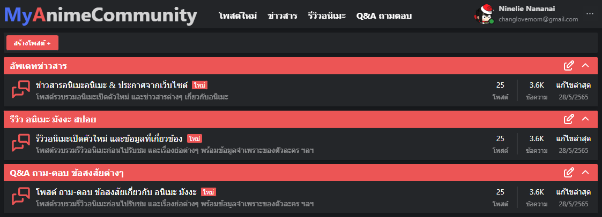
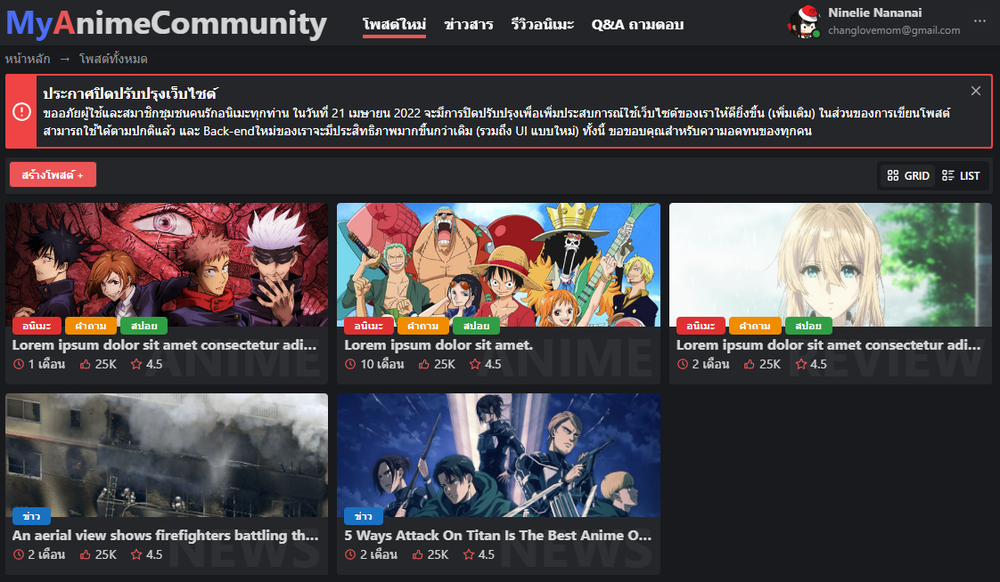
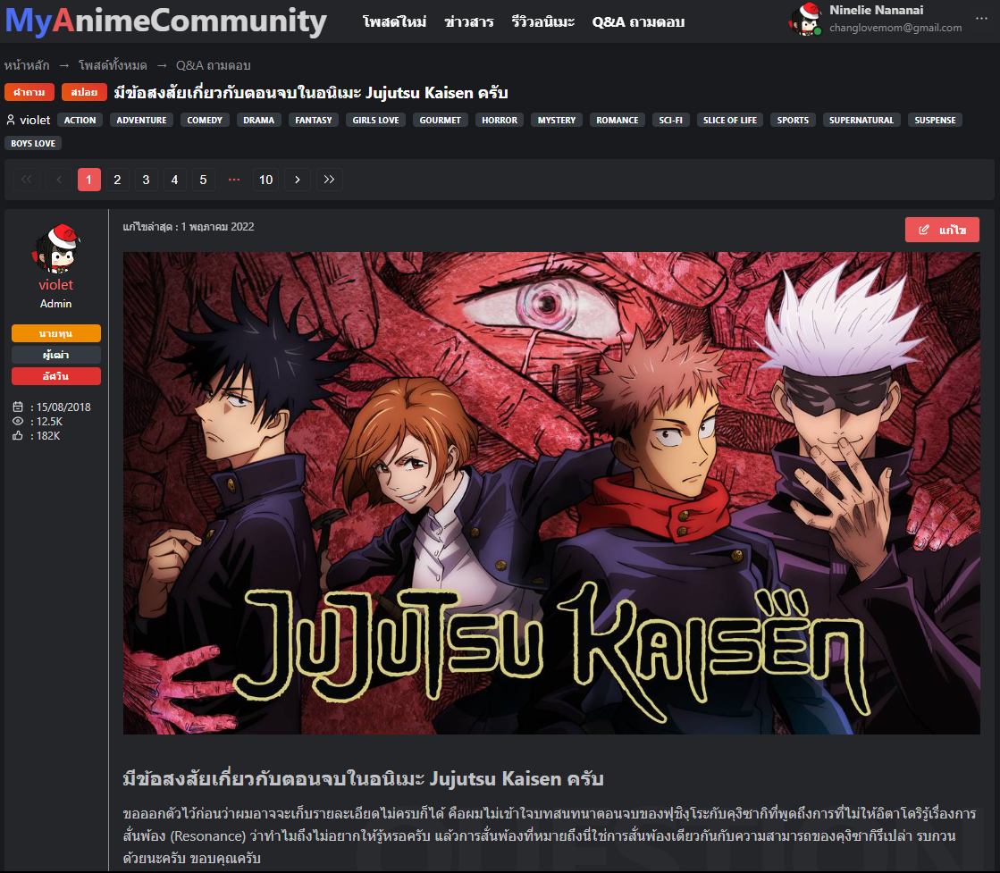

# My Anime Community

[https://myanimecommunity.vercel.app](https://myanimecommunity.vercel.app)

## Description

My Anime Community website purpose is to bring together people who like anime. They can come in and talk and exchange knowledge about anime, manga or light novels.

### Home page



### All Posts



### Post


### Comments


### Profile


### Information


## Stack

- [Next.js](https://nextjs.org/) - The React Framework for Production
- [Chakra UI](https://chakra-ui.com/) - Chakra UI is a simple, modular and accessible component library
- [Firebase](https://firebase.google.com/) - Cross-platform SDKs documentation help you build and ship apps on Android, iOS and Website

## Project structure

```
$PROJECT_ROOT
│   # Page files
├── pages
│   # React component files
├── components
│   # Non-react modules
├── lib
│   # Static files for images, video, 3d model etc.
└── public
```
